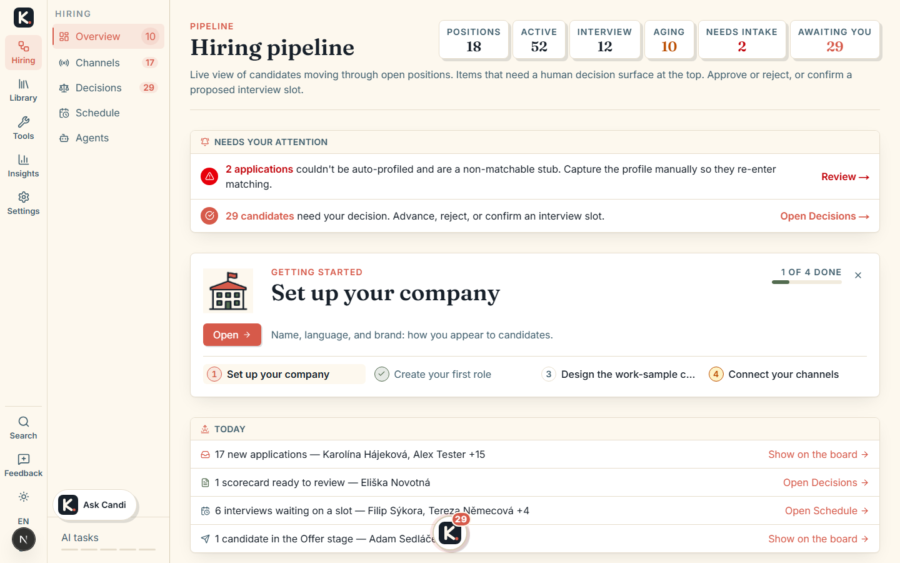

# KandiDate — an open-source hiring workspace

[](./LICENSE)

KandiDate takes a role from the first job description to a signed offer — sourcing,
CV screening, interviews, work-sample cases, scheduling and candidate email — and
keeps every candidate on one board. It is for recruiters and small hiring teams who
want AI to do the reading, drafting and scheduling while **every decision that
affects a person is approved by a human**. It runs on your own computer, on your own
data, with whichever AI model you choose — including none at all.



## Two-minute local start

You need **Node 20+** and **Python 3.11+** on your `PATH` (Python is spawned per
request for the analysis pipeline; override the binary with `PYTHON_CMD`).

```bash
git clone https://github.com/xkazm04/kp.git && cd kp
npm install
pip install -r requirements.txt      # the Python jobfit pipeline
npm run dev
```

Open `http://localhost:3000`. **No API key is required to start.** A fresh checkout
creates and seeds its own SQLite workspace (`data/kp.sqlite`) with a demo corpus —
an example JD, ~100 jobs, candidate profiles, pipeline entries — so you land on a
populated hiring board rather than an empty shell.

## Set it up with your AI

Run `claude` in the checkout and type `/onboarding`: it probes what you have
installed, asks which capabilities you actually want, writes `.env.local`, boots the
app to verify, and hands back a matrix of what is on, what is limited and exactly
which variable lifts each limit. Any group can be re-run alone later
(`/onboarding voice`). Prefer to do it by hand? Every variable, grouped and
commented, is in [`.env.example`](./.env.example); the engine-specific steps are in
[`docs/architecture/engine-setup.md`](docs/architecture/engine-setup.md).

## Local vs hosted, honestly

**It runs on your machine, on your models, on your data.** There is no hosted
component in the path of a self-hosted install, nothing phones home, and nothing is
metered — a self-hosted install has no limits at all. That is not a trial edition:
it is the entire product, under **AGPL-3.0**. A hosted version exists for teams who
would rather not run servers. It is the same software with the operations handled;
it is not a better version, and nothing here is held back from you to sell there.

| | Self-hosted (this repo) | Hosted |
| --- | --- | --- |
| Features | All of them | The same — identical code |
| Your data | Stays on your machine or your server | Held for you, with backups |
| Model cost | Whatever you plug in: a local model is free, a subscription or API key is yours | Included |
| Operations | You run it: a laptop, a NAS, a mini-PC, Docker, Helm | Zero ops, always-on, upgrades and support handled |
| Price | Nothing; no metering | Plans price outcomes — a role taken to market, a person hired — never tokens |

**If the hosted version is ever better than this repository, that is a bug.**

> **Note on the AGPL.** Run it internally however you like. If you modify KP and
> offer it to others over a network, §13 requires you to offer those users your
> modified source. Set `NEXT_PUBLIC_SOURCE_REPO_URL` to your fork so the app's own
> footer points at it.

## What each key unlocks — and what happens without it

Only set what you actually use. Everything below is opt-in; the app never hard-fails
on a missing engine, and the one feature that cannot degrade says so out loud.

| Capability | What you need | Without it |
| --- | --- | --- |
| Workspace UI — pipeline board, jobs, JD library, profiles, matrix, simulation | Nothing beyond Node 20+ and Python 3.11+ | **Works** |
| LLM judgment — automation tasks, dev-case design and evaluation, match reasoning, scorecards, campaign packs | A logged-in Claude Code CLI (the default engine), a local model server, or a provider key in **Settings → Models** | **Works, deterministic** — every LLM feature runs its rule-based implementation, no errors |
| CV analysis + salary grounding (Analyze/Match tabs, CLI scripts) | `GEMINI_API_KEY` (`GOOGLE_API_KEY` is an alias) | **Off** — fails loudly rather than pretending; the one hard requirement |
| Voice interviews (`/interview/[token]`, Interview-lab) | `ELEVENLABS_API_KEY` + `ELEVENLABS_AGENT_ID`, or `OPENAI_API_KEY` for OpenAI Realtime, or a self-hosted endpoint | **Hidden** — the feature hides itself; candidates never see a broken door |
| Spoken output (TTS) | `KP_TTS_PROVIDER` + a local (Kokoro, Piper) or cloud engine | **Degraded** — `/api/tts` answers a typed 503; nothing else depends on it |
| Sending candidate email | `COMMS_WEBHOOK_URL` relay (+ `COMMS_CALLBACK_SECRET` for receipts) | **Degraded, honest** — messages are recorded as `queued` and the UI says nothing is being sent |
| Inbound events while KP is off (webhooks, mail, bounce receipts) | `KP_EDGE_URL` + `KP_EDGE_SECRET` — the free Worker in [`edge/`](edge/README.md), in your own Cloudflare account; optional `KP_NUDGE_TARGET` | **Works** — events reach KP only while it runs, and every surface says so |
| Calendar sync (Google free/busy + writeback) | `GOOGLE_OAUTH_CLIENT_ID` + `GOOGLE_OAUTH_CLIENT_SECRET` | **Works, link-based** — scheduling with KP-side collision checks only |
| GitHub repo-signal deep dive | `GITHUB_TOKEN` (raises rate limits) | **Works** on the anonymous 60/hr limit |
| Encrypted provider keys in Settings | `KP_SECRET` (AES-256-GCM at rest) | **Degraded** — env-configured providers work; saving a key in Settings is refused until it exists |
| A password on the operator routes | `KP_OPERATOR_PASSWORD` | **Works open** on a laptop; a production build refuses to start open unless `KP_ALLOW_OPEN=1` says you meant it |
| Observability (LightTrack tracing, Sentry) | `LIGHTTRACK_URL` + `LIGHTTRACK_PROJECT`, `SENTRY_DSN` | **Works** with zero observability egress |
| Payment plans | `POLAR_*` — only for running KP *as a paid service* | **Works** — nothing is metered |

### Run it your way

**Bring your own model.** Every AI call routes to a provider you choose. Configure
it in **Settings → Models**, or leave it alone and take the defaults:

| You have | What to do | Cost |
| --- | --- | --- |
| **A local model server** (Ollama, LM Studio, llama.cpp, vLLM, LiteLLM) | Settings → Models → add a key row for `ollama` (or `openai`) and set **Server URL** to e.g. `http://localhost:11434/v1`. No API key needed. | free |
| **A Claude Pro/Max subscription** | Install the Claude Code CLI and `claude` → `/login`. This is the default engine when nothing else is configured. | your subscription, not metered API |
| **A provider API key** | Paste a Gemini / OpenAI / Anthropic / Azure / OpenRouter / Qwen key in Settings → Models. | your provider's bill |
| **Nothing at all** | Nothing. Every LLM feature has a deterministic fallback and the app runs without complaint. | free |

That last row is a **product property**, not a degraded mode we tolerate: the
fallbacks are the same paths that run when a provider is down. Which local model is
good enough? A local 8B is genuinely fine for single-extraction and single-decision
work and noticeably weaker on multi-deliverable output — numbers in
[`docs/development/benchmarks.md`](docs/development/benchmarks.md).

**Air-gapped / no egress.** `KP_OFFLINE=1` installs a global egress guard: no
outbound network call leaves the process except to loopback and the private
endpoints you configured. Point it at a local model server and the whole product
runs with no internet at all. Both halves (TypeScript `fetch` guard + the Python
engines' own refusal) are application backstops — a network policy at the
deployment layer is still the real guarantee.

**Laptop, home box, or server.** Local-first does not have to mean "my laptop": the
same `next start` on a Raspberry Pi, a NAS or any always-on mini-PC is a full
install with nothing switched off, and the Docker image already exists. If it *is*
your laptop, the optional edge — an answering machine for webhooks and candidate
mail in your own Cloudflare account, holding no keys and no database — is described
in [`docs/architecture/self-hosting.md`](docs/architecture/self-hosting.md) §7b.
Docker, Helm and the production checklist are in the same guide.

## Where to go next

- [`docs/README.md`](docs/README.md) — the documentation index: what is implemented
  ([features](docs/features/README.md)), the contracts behind it
  ([architecture](docs/architecture/README.md)), the design system, and how to build,
  test and evaluate ([development](docs/development/README.md)).
- [`docs/features/README.md`](docs/features/README.md) — a tour of the workspace tabs
  and the candidate-facing pages.
- [`CONTRIBUTING.md`](./CONTRIBUTING.md) — setup, the verification gate, and the five
  conventions that actually bite. Bug reports, translations and patches welcome.
- [`docs/development/change-review.md`](docs/development/change-review.md) — most
  commits here are AI-written, so every change is read back by two lenses before it
  lands: a deterministic pass over the diff, and a model reviewing it against this
  repository's own written rules. What runs, where, and what a finding costs.
- [`SECURITY.md`](./SECURITY.md) — security issues go there, never a public issue.
- [`LICENSE`](./LICENSE) — AGPL-3.0.
